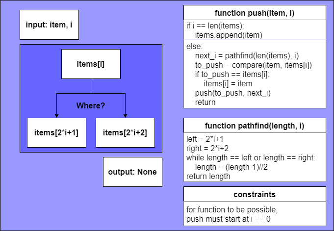

# Priority Queue

## Abstract

- an extended version of queue
- every item has a priority(우선순위)
- higher priority item is dequeued before one with lower priority
- if priority is same, follows the order of the queue(FIFO)

---

## Operations

- insert(item, priority): inserts an item with given priority
- getHighestPriority(): returns the highest priority item
- deleteHighestPriority(): removes the highest priority item
  - these can all derive from MinHeap
  - though, heap must use priority in comparison

---

## in Python (implementation)

### Class Item:

- attributes: self.item, self.priority
- method: check priority

### Class PriorityQueue:

- attributes: self.items a list of Class Item
- methods: insert(item, priority), getHighestPriority(), deleteHighestPriority()
  - above methods show characteristic of priority queue
  - (FIFO) first-in first-out, and sort the items via priority
  - concerning FIFO, conditions when priorities of two items are same must be manipulated carefully
    - which is, not properly concerned in my code => need adjustments

---

## Binary Heap

- most common way to implement priority queue
- a complete binary tree
- min, max heap - parent smaller / bigger than child nodes always
- level order traversal

### adjacent node to i'th node

| index       | description          |
| ----------- | -------------------- |
| A[(i-1)//2] | the parent node      |
| A[(2*i)+1]  | the left child node  |
| A[(2*i)+2]  | the right child node |

### methods (min heap)

- push(item) - pushes an item to the heap
- extractMin() - returns and removes minimum of heap
- getMin() - returns minimum item of heap
- decreaseKey(i, val) - decrease heap[i] to val
- deleteKey(i) - delete heap[i]
- to implement above methods, need *heapify*, *heappop*, *heappush*

---

## Algorithms - Confusing

### Class MinHeap:

- self.items = list()

### heappush

- to push an item(maybe given priority) to a heap, it is like a salmon swimming against a river
- since heap is a complete binary tree, you must know the path to be pushed (pathfinding)
- and also know which item will be pushed, [an input item or item of the i'th index]
- if items[i], i'th index of the items is to be pushed, you need to change items[i] to an input item
- 
- heappush pushes a item to index 0, cascading through the possible path(left or right)
- more fancy algorithm could exist, and recommend using python **heapq** module **heappush** method

### heappop

- more complicated than heappush, due to more conditions while popping out the element
- similar in a way that finds path to the last index of items list
- while pushing the item to be popped
  1. i is equal to the last index of items list - items.pop(-1)
  2. have only one child - swap(i, 2 * i+1) and call pop(2 * i+1)
  3. both child 
     - smaller one of items[2i+1], items[2i+2] => pushed to items[i]
     - items[i] pushed to the designated path(by pathfinding)
     - if items[i] pushed to smaller one of items[2i+1], items[2i+2] => need no changes
     - else => need to **heapify** heap of child which is not pushed by items[i]

### heapify

- assumption: both child must satisfy **heap** conditions
  - if not? must heapify from leaves
- input: the index of the parent node **i**
- if the parent node **i** satisfies the heap condition, returns immediately
- else if parent node **i** not satisfies the heap condition for only one child **i_child**
  - swap(**i**, **i_child**) => heapify(**i_child**)
- else = parent node **i** not satisfies the heap condition for both child (**i_left**, **i_right**)
  - swap(**i**, **i_left**) if **i_left** is prior to **i_right**, swap(**i**, **i_right**) if **i_right** is prior to **i_left**
  - then heapify(**i_left**) if **i_left** is prior to **i_right**, heapify(**i_right**) if **i_right** is prior to **i_left**

---

## Review

- a heap data structure inherits a complete binary tree, but more fancier. 
- since it implements a tree structure through array, more memory will be saved. 
- but inserting and deleting algorithms are more complicated than tree data structure. 
- meeting the conditions during insertion and deletion would be the key in maintaining heap structure. 

---

## Code

- [minheap.py](./codes/minheap.py)
- [priorityqueue.py](./codes/priorityqueue.py)

---

## Reference

- [Priority Queue | Set 1 (Introduction)](https://www.geeksforgeeks.org/priority-queue-set-1-introduction/)
- [Binary Heap](https://www.geeksforgeeks.org/binary-heap/)