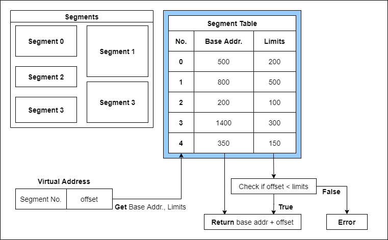

# Paging and Segmentation

## Abstract

*Paging* and *Segmentation* are main technique in implementing non-contiguous allocation. Non-contiguous allocation is the solution to the problems of contiguous allocation. Non-contiguity of the process is implemented through the concept of virtual address, and the mapping from virtual to physical address. 

---

## Terms

- **Virtual (or Logical) Address**: An address generated by the *CPU*
- **Virtual (or Logical) Address Space**: The set of all virtual addresses generated by a *program*
  - **Page**: Fixed-size blocks in *Virtual Address Space*
- **Physical Address**: An actual address on memory
- **Physical Address Space**: The set of all physical addresses
  - **Frame**: Fixed-size blocks in *Physical Address Space*
    - *Frame* has same size of *Page*

---

## Paging

### Abstract

The implementation of non-contiguous allocation. Requires more resources than contiguous allocation techniques. Those are *Page Table*, *Translation from Virtual to Physical address at Run-time*, etc. Use of Translation Look-aside Buffer(TLB) may be helpful for faster Paging. Having advantages in *efficiency of main memory*, *spanning*, *multiprogramming*. The problem in paging is called *page faults*, when a page of a process does not reside in the main memory. Cascading page faults is called *thrashing*, which is far more critical than *page faults*. Two main causes of thrashing are *high degree of multiprogramming*, and *lack of frames*. 

### Assumption

- (Page size == Frame size): X-bits
- Virtual address: V-bits, Physical address: P-bits
- X < V, X < P

### Procedure

1. Get the number of frames and pages
   - Number of *Frames* = (P - X)-bits, Number of *Pages* = (V - X)-bits
2. (V-X) bits = Page indexes, (P-X) bits = Frame indexes
3. *Page_Table[Page_index] = Frame_Index*
   - *Page fault* can occur, if *Page_index* is not in *Page_Table*
4. Using *Frame_Index*, get physical address, access the memory


### Translation Look-aside Buffer (TLB)

If page table is huge, then using TLB to boost paging execution is possible. 

1. Look at TLB if Page is in Cache
2. If True, TLB hit (Cache hit) - access physical address
3. If False, TLB miss - Look at Page table to access physical address

```pseudocode
assume, c = TLB access time, x = TLB hit ratio, m = memory access time
access_time = x * (c + m) + (1-x) * (c + 2*m)
if hit, accesses TLB - memory = (c + m)
if miss, accesses TLB - memory(page table) - memory = (c + 2*m)
```

### Page Faults

Since virtual address space can be larger than physical address space, there is a possibility that page doesn't reside inside the main memory. The event of missing page is called *Page Faults*. They are quite costly compared to the cost of referencing a page table, since they includes access to the secondary memory(disk). Below explains how the OS handles page faults. 

1. reference page table - *page miss*
2. the OS *traps* the event
   - Program Counter(PC), Instruction state saved in CPU registers
3. *search* for missing page in the *disk*
4. *bring in* missing page from the disk to *main memory*
   - if no frames are free, do page replacement algorithm to remove a page
   - if frame dirty, it is transferred to disk
   - ensured empty frame, *brings in*
5. *reset* the *page table*, with the missing page included
6. *restart* the instruction

### Page Replacement Algorithms

1. **First In First Out** (FIFO)
   - *Belady's anomaly* - increase of the number of page frames can make more page faults
2. **Optimal Page replacement**
   - Remove the page that *will not be used for longest time* in future
   - is *perfect*, though *not practical*
3. **Least Recently Used** (LRU)
   - Remove the page that *has not been used for longest time* in present

---

## Segmentation

Segments is the chunks of a process, which can have various sizes. Variety in size provides the user's view to the process. *Virtual memory segmentation* is similar to *paging*, the difference are that chunks can have different sizes and the information is in *Segment Table*. *Simple segmentation* is non-contiguous, though all chunks of the process have to reside in the main memory. 

### Segment Table

- **Index**: Segment number
- **Base address**, **Limit**: A segment starts at *base address*, ends at *base address + limit*
- **Virtual address**: *segment number* + *offset*
- if, *offset* is larger than *limit*, then error

### Pros & Cons

- No internal fragmentation
- Consume less space than page table
- External fragmentation



---

## Reference

- [Paging in Operating System](https://www.geeksforgeeks.org/paging-in-operating-system/)
- [Virtual Memory](https://www.geeksforgeeks.org/virtual-memory-operating-systems/)
- [Page Fault Handling](https://www.geeksforgeeks.org/operating-system-page-fault-handling/)
- [Techniques to handle Thrashing](https://www.geeksforgeeks.org/techniques-to-handle-thrashing/)
- [Belady’s anomaly](https://www.geeksforgeeks.org/operating-system-beladys-anomaly/)
- [Page Replacement Algorithms](https://www.geeksforgeeks.org/operating-system-page-replacement-algorithm/)
- [Segmentation in Operating System](https://www.geeksforgeeks.org/segmentation-in-operating-system/)

